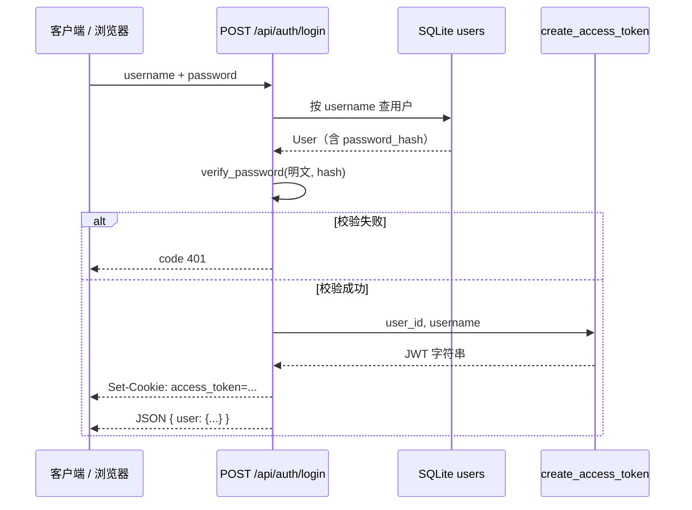
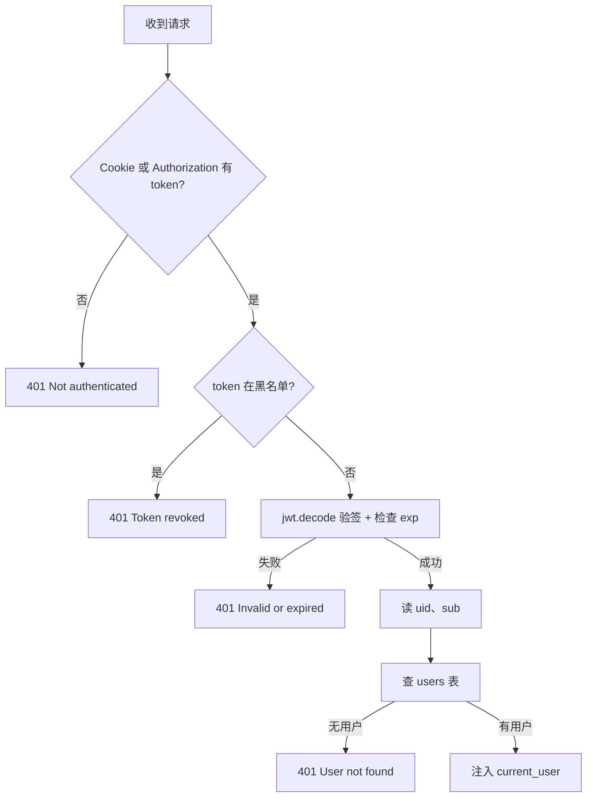

# Memory Jar · 登录与 Token 说明

本文档说明当前后端的认证方式：密码如何存储、登录后 Token 如何生成与写入 Cookie、后续请求如何自动携带与校验，以及登出时如何失效。

---

## 1. 总览

| 环节 | 做法 | 存储位置 |
|------|------|----------|
| 用户密码 | bcrypt 单向哈希 | SQLite `users.password_hash` |
| 登录凭证 | JWT（HS256 签名） | 浏览器 Cookie `access_token` |
| 登出黑名单 | 内存 Set | 进程内 `revoked_tokens`（重启清空） |

**认证方式**：Cookie 优先；仍兼容 `Authorization: Bearer <token>`（便于 curl / 脚本）。

相关代码：

| 模块 | 路径 |
|------|------|
| 登录 / 登出 / 当前用户 | `app/api/auth.py` |
| Token 与 Cookie 工具 | `app/core/security.py` |
| 鉴权依赖 | `app/core/deps.py` |
| 配置项 | `app/core/config.py` |
| 用户表 | `app/db/models.py` |

---

## 2. 密码存储（注册 / 初始化）

密码**不会明文入库**，使用 **bcrypt 哈希**（单向，不可还原）。

初始化默认用户（`app/db/init_db.py`）：若 `users` 表为空，写入一条默认账号：

```python
User(
    username=settings.default_username,      # 默认 admin
    password_hash=hash_password(settings.default_password),  # 默认 1234
)
```

`hash_password` / `verify_password` 在 `app/core/security.py`：

```python
def hash_password(password: str) -> str:
    return bcrypt.hashpw(password.encode(), bcrypt.gensalt()).decode()

def verify_password(plain_password: str, hashed_password: str) -> bool:
    return bcrypt.checkpw(plain_password.encode(), hashed_password.encode())
```

> **说明**：这是**哈希**，不是加密。登录请求体里仍是明文密码，生产环境应使用 **HTTPS** 保护传输。

---

## 3. 登录流程

### 3.1 接口

```
POST /api/auth/login
Content-Type: application/json

{
  "username": "admin",
  "password": "1234"
}
```

### 3.2 处理步骤



对应代码（`app/api/auth.py`）：

1. 查用户：`db.query(User).filter(User.username == body.username).first()`
2. 校验密码：`verify_password(body.password, user.password_hash)`
3. 生成 Token：`create_access_token(user_id=..., username=...)`
4. 写入 Cookie：`set_auth_cookie(response, access_token)`
5. 返回用户信息（**响应体不含 token**）

### 3.3 成功响应示例

```json
{
  "code": 200,
  "message": "success",
  "data": {
    "user": {
      "id": 1,
      "username": "admin",
      "created_at": "2026-06-11T06:53:17"
    }
  }
}
```

响应头会附带：

```http
Set-Cookie: access_token=eyJhbGciOiJ...; HttpOnly; Path=/; SameSite=lax; Max-Age=604800
```

---

## 4. Token 如何生成

`create_access_token`（`app/core/security.py`）使用 **python-jose** 生成 JWT：

```python
payload = {
    "sub": username,   # 用户名
    "uid": user_id,      # 用户 ID
    "exp": expire,       # 过期时间（UTC）
}
jwt.encode(payload, settings.jwt_secret, algorithm="HS256")
```

| 配置项 | 环境变量 | 默认值 | 含义 |
|--------|----------|--------|------|
| 签名密钥 | `JWT_SECRET` | `memory-jar-dev-secret-change-me` | HS256 密钥 |
| 算法 | `JWT_ALGORITHM` | `HS256` | 对称签名 |
| 有效期 | `JWT_EXPIRE_MINUTES` | `10080`（7 天） | Token 过期分钟数 |

> JWT 是**签名**而非加密：payload 可被 Base64 解码查看，靠 `jwt_secret` 防止篡改。

---

## 5. Token 如何存储（Cookie）

登录成功后，Token 写入 **HttpOnly Cookie**，不由前端 JS 读写。

Cookie 参数（`set_auth_cookie`）：

| 属性 | 值 | 说明 |
|------|-----|------|
| 名称 | `access_token`（可配置） | `AUTH_COOKIE_NAME` |
| HttpOnly | `true` | 防 XSS 脚本窃取 |
| Path | `/` | 全站 API 可用 |
| SameSite | `lax`（可配置） | `AUTH_COOKIE_SAMESITE` |
| Secure | `false`（开发默认） | 生产 HTTPS 建议 `true` |
| Max-Age | 与 JWT 有效期一致 | 秒 |

配置示例（`.env`）：

```env
AUTH_COOKIE_NAME=access_token
AUTH_COOKIE_SECURE=false
AUTH_COOKIE_SAMESITE=lax
JWT_SECRET=your-production-secret
JWT_EXPIRE_MINUTES=10080
```

---

## 6. 后续请求如何获取 Token

### 6.1 浏览器 / Swagger（同域）

访问 `http://localhost:8000/docs` 时：

1. 先调用 **登录**
2. 浏览器保存 Cookie
3. 再调 **`GET /api/auth/me`** 或 **`POST /api/auth/logout`** 时，浏览器**自动**在请求头带上：

```http
Cookie: access_token=eyJhbGciOiJ...
```

无需手动填写 Authorization。

### 6.2 前端跨域（5173 → 8000）

前端请求需开启携带 Cookie：

```javascript
fetch('http://localhost:8000/api/auth/me', {
  credentials: 'include',
})
```

后端 CORS 已配置 `allow_credentials=True`，且 `allow_origins` 不能为 `*`（当前默认允许 `http://localhost:5173`）。

若本地跨域 Cookie 不生效，可选：

- Vite 开发代理，使 API 与前端同域；或
- `AUTH_COOKIE_SAMESITE=none` + `AUTH_COOKIE_SECURE=true`（需 HTTPS）

### 6.3 服务端读取顺序

`extract_access_token`（`app/core/security.py`）：

1. **优先**从 Cookie：`request.cookies.get("access_token")`
2. **否则**从 Header：`Authorization: Bearer <token>`

### 6.4 curl 示例

```bash
# 登录并保存 Cookie
curl -c cookies.txt -X POST "http://localhost:8000/api/auth/login" \
  -H "Content-Type: application/json" \
  -d "{\"username\":\"admin\",\"password\":\"1234\"}"

# 自动带 Cookie 查询当前用户
curl -b cookies.txt "http://localhost:8000/api/auth/me"

# 登出
curl -b cookies.txt -X POST "http://localhost:8000/api/auth/logout"
```

仍可用 Bearer（不依赖 Cookie 文件）：

```bash
curl "http://localhost:8000/api/auth/me" \
  -H "Authorization: Bearer <jwt>"
```

---

## 7. Token 校验流程（/me 等受保护接口）

受保护接口通过依赖 `get_current_user`（`app/core/deps.py`）鉴权：



`GET /api/auth/me` 成功响应：

```json
{
  "code": 200,
  "message": "success",
  "data": {
    "id": 1,
    "username": "admin",
    "created_at": "2026-06-11T06:53:17"
  }
}
```

---

## 8. 登出流程

```
POST /api/auth/logout
```

步骤：

1. 从 Cookie（或 Authorization）取出 token
2. `revoke_token(token)` → 加入内存黑名单 `revoked_tokens`
3. `clear_auth_cookie(response)` → 清除浏览器 Cookie
4. 返回 `{ "message": "Logged out" }`

登出后同一 token 即使未过期，再次访问 `/me` 也会返回 401。

> 黑名单在**进程内存**中，服务重启后清空；生产环境可改为 Redis 等持久化存储。

---

## 9. API 一览

| 方法 | 路径 | 是否需要登录 | 说明 |
|------|------|--------------|------|
| POST | `/api/auth/login` | 否 | 校验密码，写 Cookie |
| POST | `/api/auth/logout` | 是 | 吊销 token，清 Cookie |
| GET | `/api/auth/me` | 是 | 返回当前用户信息 |

Swagger 文档：启动服务后访问 [http://localhost:8000/docs](http://localhost:8000/docs)，分组 **Auth**。

---

## 10. 安全相关说明

|  topic | 当前实现 | 生产建议 |
|--------|----------|----------|
| 密码 | bcrypt 哈希入库 | 保持；传输走 HTTPS |
| Token | JWT 签名（HS256） | 更换强随机 `JWT_SECRET` |
| Cookie | HttpOnly | 生产设 `Secure=true` |
| 登出 | 内存黑名单 | 换 Redis，支持多实例 |
| Token 内容 | 含 username、uid | 不要放敏感信息；JWT 可被解码 |

---

## 11. 与 database.md 的对应关系

- 用户账号持久化在 SQLite 表 `users`，见 [database.md](./database.md) 第 1 节。
- Token **不写入数据库**，只在 Cookie（客户端）与 JWT 黑名单（内存）中存在。
